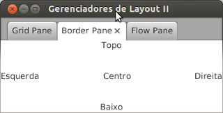
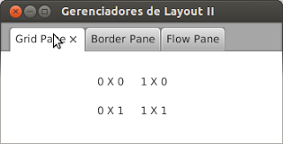
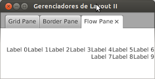

# Gerenciando Layout: BorderPane, FlowPane e o GridPane

Nesse capítulo vamos apresentar o BorderPane, FlowPane e o GridPane. A arquitetura deles é a mesma, se você quiser saber mais sugiro que releia o capítulo anterior.

### BorderPane

Uma das heranças do bom e velho Swing é o **BorderPane**. A idéia é bem simples: você coloca os componentes em regiões do painel. Essas regiões são referenciadas como: norte, sul, leste, oeste e centro.

Não há nenhum segredo no uso dele, mas há um pequena diferença que é termos que informar na hora de adicionar os componentes a qual região o mesmo pertence. Vamos ao exemplo de código e em seguida a explicação.

```java
BorderPane borderPane = new BorderPane();
Label lblTop, lblEsquerda, lblBaixo, lblDireita, lblCentro;
// 1
borderPane.setTop(lblTop = new Label("Topo"));
borderPane.setLeft(lblEsquerda = new Label("Esquerda"));
borderPane.setBottom(lblBaixo = new Label("Baixo"));
borderPane.setRight(lblDireita = new Label("Direita"));
borderPane.setCenter(lblCentro = new Label("Centro"));
// 2
BorderPane.setAlignment(lblTop, Pos.CENTER);
```

1. Ao contrário dos layouts apresentados no último capítulo, o BorderPane não utiliza os métodos add, set e remove que falamos no nosso último capítulo, mas sim métodos correspondentes à região da tela. Os métodos _setTop_, _setLeft_, _setBottom_, _setRight_ e _setCenter_, são respectivamente para informar os nós do topo, esquerda, baixo, direita e centro. Esses nós são agrupados dentro do espaço do BorderPane
2. Nessa parte mostramos como alinhamos um nó. Veja que usamos um método estático para isso, o que já gerou muitas críticas. Cabe a você tentar outros valores de **Pos** na chamada desse método!

Abaixo o resultado desse código:



### GridPane

O GridPane, ou painel de grade, permite adicionar componentes em posições específicas semelhantes á uma grade de nós. Para entender melhor imagine a área do **GridPane** como um tabuleiro de batalha naval. Nesse tipo de jogo, temos os campos definidos por divisões, como por exemplo A1, B5, etc. O GridPane atua de forma semelhante, posicionando componentes nessa grade. No entanto, especificamos a posição com dois números invés de uma letra e um número, exemplo: 1-1, 5-2, etc. Esse gerenciador de leiaute também não utiliza os métodos add, set e remove. Na verdade, no momento de adicionar o componente já especificamos qual a "gradezinha" ele vai ocupar. Vamos a um exemplo de código para esclarecer.

```java
GridPane gridPane = new GridPane();
// 1 
gridPane.add(new Label("0 X 0"), 0, 0);
gridPane.add(new Label("0 X 1"), 0, 1);
gridPane.add(new Label("1 X 0"), 1, 0);
gridPane.add(new Label("1 X 1"), 1, 1);
// 2
gridPane.setVgap(20);
gridPane.setHgap(20);
// 3
gridPane.setTranslateX(120);
gridPane.setTranslateY(30);
```

1. Estamos adicionando um componente ao **GridPane** e informando a posição X e Y que ele vai ocupar na grade. Um label está sendo adicionado para mostrar para você onde cada elemento vai ficar
2. Esses métodos server para informar o espaçamento entre os componentes adicionados. _setVgap_ é para o espaço na vertical e _setHgap_ para o espaço na horizontal. "Gap" pode ser traduzido como "lacuna".
3. Por fim configuramos a posição dos componentes na tela. Assim como qualquer nó, podemos informação a posição X e Y do componente no "pai" dele.
   E isso resulta em:



### FlowPane

"Painel de Fluxo" é um significado ao pé da letra para **FlowPane**. Como o nome diz, é um painel que segue o fluxo da coisa, ou seja, você vai adicionando componentes e ele vai colocando de acordo com o fluxo. O fluxo pode ser na vertical ou horizontal e os componentes podem ser posicionados de forma centralizada, centralizada na vertical, tudo ao topo, etc. Parece difícil, mas é um dos paineis mais simples. Por exemplo, digamos que você utilize um desses do tipo horizontal e adicione 4 componentes. O 4 não caberia na mesma linha, então o FlowPane coloca ele na "linha abaixo", mesmo sobrando espaço na terceira linha. O mesmo acontece para o FlowPane na vertical, mas aí ele colocaria os componentes na próximo coluna, seguindo o fluxo. Lembrando que isso é dinâmico, se vocề redimensiona o pai, ele realoca os componentes sempre seguindo o fluxo. Mas chega de papo e vamos ao código.

```java
// 1
FlowPane flowPane = new FlowPane();
// 2
flowPane.setAlignment(Pos.CENTER_RIGHT);
for (int i = 0; i < 10; i++) {
    // 3    
    flowPane.getChildren().add(new Label("Label " + i));
}
```

1. Criamos o nosso **FlowPane**. Falei que podemos a direção do fluxo. Isso pode ser feito direto no construtor usando a classe **Orientation**;
2. Aqui setamos o alinhamento: centro, centro para a direita, centro // para esquerda, topo para esquerda, etc. Brinque com outros valores; :\)
3. Adicionando um componente ao nosso Painel. Isso é feito da forma simples já mostrada em seções anteriores anterior.

Bem, aqui está o resultado do código acima:



O código geral pode ser encontrado nesse mesmo repositório, lá vocês poderão ver os valores de _import_ para as classes usadas.

