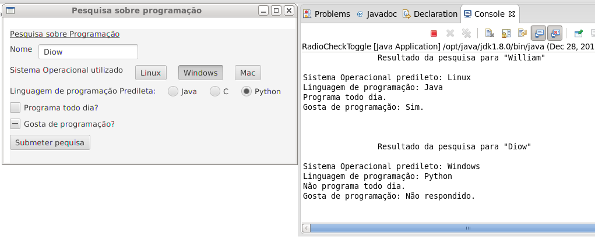

# Radio Button, CheckBox e ToggleButton

Vamos para mais um capítulo e nesse vamos falar sobre mais alguns controles de interface, especificamente sobre botões agrupados, mas que permitem a seleção individual, e também sobre a caixa de checagem, que representam um valor booleano (sim ou não, verdadeiro ou falso).

### Várias possibilidades, uma escolha

Os botões de rádio, **RadioButton**, ou os botões alternados, **ToggleButton**, permitem apresentar um grupo de botão no qual é permitido selecionar somente um. Esse controle de não deixar dois botões serem selecionados é feito atráves de um grupo de botões, **ToggleGroup**, que recebe os mesmos e então controla o comportamento deles. 

O uso desse tipo de botão é feito em diversos casos onde você tem escolhar bem pré-definidas, por exemplo: campos para escolha de sexo, faixa de salário, alternativas de questões multivaloradas com uma resposta válida, entre outros.

### Três estados, um controle

O segundo controle de interface que vamos mostrar hoje é simples e bastante utilizado em formulários para pedido de informações de usuários quando temos uma questão direta (exemplo: "Você Fuma?"). Estamos falando da caixa de checagem, **CheckBox**, que na verdade tem três estados: selecionado, não selecionado e indeterminado (você pode escolher se quer habilitar esse estado ou não). 

Pode parecer estranho, mas um problema que podemos ter é pedir a entrada de um usuário e o mesmo sequer ligar para esse campo, daí ele larga o campo em branco, logo, como você vai fazer para saber se ele não respondeu ou não marcou com o objetivo de responder de forma negativa à pergunta? 

### A hora mais feliz

Vamos agora colocar esses botões em uma tela JavaFX e  mostrar algumas classes novas para posicionar os componentes. Vamos avançar um pouco o nível: já foram alguns capítulos só com aplicações simples, temos que colocar um pouco mais de emoção e daqui a pouco já estaremos trabalhando com aplicações grandes com JavaFX. 

O programa abaixo representa um programa de uma pesquisa simples sobre programação. Com ele vamos mostrar o que discutimos nesse capítulo e algumas coisas novas:


```java
package javafxpratico;

import javafx.application.Application;
import javafx.scene.Scene;
import javafx.scene.control.Button;
import javafx.scene.control.CheckBox;
import javafx.scene.control.Label;
import javafx.scene.control.RadioButton;
import javafx.scene.control.TextField;
import javafx.scene.control.ToggleButton;
import javafx.scene.control.ToggleGroup;
import javafx.scene.layout.HBox;
import javafx.scene.layout.VBox;
import javafx.stage.Stage;

public class RadioCheckToggle extends Application {
	public static void main(String[] args) {
		launch();
	}

	@Override
	public void start(Stage palco) throws Exception {
		VBox raiz = new VBox(10);
		raiz.setTranslateX(10);
		raiz.setTranslateY(20);

		Label lblTitulo = new Label("Pesquisa sobre Programação");
		lblTitulo.setUnderline(true); // 1

		final TextField txtNome = new TextField();
		HBox hbNome = new HBox(10); // 2
		hbNome.getChildren().addAll(new Label("Nome"), txtNome);

		HBox hbSo = new HBox(20);
		ToggleButton tbLinux = new ToggleButton("Linux"); // 3
		tbLinux.setSelected(true);
		ToggleButton tbWindows = new ToggleButton("Windows");
		ToggleButton tbMac = new ToggleButton("Mac");
		final ToggleGroup tgSo = new ToggleGroup(); // 4
		tgSo.getToggles().addAll(tbLinux, tbWindows, tbMac); // 5
		hbSo.getChildren().addAll(new Label("Sistema Operacional utilizado"), 
		    tbLinux, tbWindows, tbMac);

		final ToggleGroup tgLinguagem = new ToggleGroup();
		HBox hbLinguagens = new HBox(20);
		RadioButton rbJava = new RadioButton("Java"); // 6
		rbJava.setSelected(true);
		RadioButton rbC = new RadioButton("C");
		RadioButton rbPython = new RadioButton("Python");
		tgLinguagem.getToggles().addAll(rbJava, rbC, rbPython);
		hbLinguagens.getChildren().addAll(new Label(
				"Linguagem de programação Predileta:"), rbJava, rbC, rbPython);

		final CheckBox chkFrequencia = new CheckBox("Programa todo dia?"); // 7
		final CheckBox chkGosto = new CheckBox("Gosta de programação?");
		chkGosto.setAllowIndeterminate(true); // 8
		chkGosto.setIndeterminate(true);

		Button btnSubmeter = new Button("Submeter pequisa");
		btnSubmeter.setOnAction(e -> {
			System.out.println("\t\tResultado da pesquisa para \"" 
					+ txtNome.getText() + "\"\n");
			// Podemos não ter um SO selecionado
			ToggleButton tbSo = (ToggleButton) tgSo.getSelectedToggle(); // 9
			System.out.print("Sistema Operacional predileto: ");
			System.out.println(tbSo == null ? "Não selecionado." : tbSo.getText());

			// Deve ter uma linguagem selecionada
			RadioButton rbLinguagem = (RadioButton) tgLinguagem.getSelectedToggle();
			System.out.println("Linguagem de programação: " + rbLinguagem.getText());
			// 10
			System.out.println(
					(chkFrequencia.isSelected() == true ? "P" : "Não p") + 
				"rograma todo dia.");

			System.out.print("Gosta de programação: ");
			if (chkGosto.isSelected()) {
				System.out.println("Sim.");
				// 11
			} else if (chkGosto.isIndeterminate()) {
				System.out.println("Não respondido.");
			} else {
				System.out.println("Não.");
			}
			System.out.println("\n\n");
		});
		raiz.getChildren().addAll(lblTitulo, hbNome, 
				hbSo, hbLinguagens, chkFrequencia, 
				chkGosto, btnSubmeter);

		Scene cena = new Scene(raiz, 500, 250);
		palco.setTitle("Pesquisa sobre programação");
		palco.setScene(cena);
		palco.show();
	}
}
```
***Explicação do Código***

1. Já começamos mostrando uma propriedade do **Label**. Se você chamar esse método e enviar **true**, ele será sublinhado;
2. Esse componente é novo, mas o primo dele, **VBox**, funciona de forma muito semelhante. As propriedades são exatamente as mesmas, a diferença é que a **HBox** os componentes são organizados horizontalmente;
3. Nessa linha estamos criando o tão falado botão alternado **ToggleButton**. Vamos usar três. Daqui a pouco teremos que adicionar ele a um grupo junto com outros botões alternados, assim somente um poderá ser escolhido nesse grupo, mas há a possibilidade de não escolher nenhum. Perceba que estamos informando no construtor o texto que ele irá mostrar;
4. O grupo que falamos no passo anterior é representado pela classe ToggleGroup. Ele agrupo objetos do tipo **Toggle**, que é a classe pai do **ToggleButton** e do **RadioButton**;
5. Nessa linha simplesmente adicionamos os botões já declarados para o grupo, dizendo que eles não podem ser selecionados simultaneamente;
6. Semelhante ao **ToggleBox**, temos o **RadioButton**. A maior diferença está na aparência e que um grupo de **RadioButton** não permite um botão não selecionado;
7. Aqui usamos uma caixa de checagem, **CheckBox**. A String enviada no construtor também é o texto associado à ela;
8. Dizemos que essas caixas de checagem têm três estados. Nessa linha habilitamos o terceiro estado, o estado indeterminado (quântico?);
9. Dentro do listener do botão usando Lambda, estamos lendo as propriedades dos controles de interface apresentados. Essa linha especificamente retorna o **Toggle** selecionado. Como sabemos que esse grupo contém toggles do tipo **ToggleButton**, já fazemos um *cast* para esse tipo. Se nada estiver selecionado, null é retornado;
10. O *isSelected* retorna um valor booleano para informar se essa caixa está selecionada;
11. Por fim(ufa), usamos o método *isIndeterminate* para sabermos se o estado dessa **CheckBox** é indeterminado.

Nossa aplicação final se parece com o seguinte:



