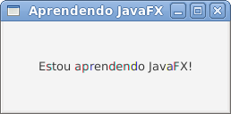

# Um "Olá Mundo" com JavaFX

Nesse primeiro artigo vamos mostrar um passo a passo de como executar sua primeira aplicação usando JavaFX! A versão usada é a que vem no Java 8. 

*Antes de prosseguir, confira se você instalou o JDK 8 da Oracle corretamente na sua máquina e também o Eclipse!*

Ótimo! Já temos tudo o que precisamos. O próximo passo agora é abrir o Eclipse e criar um projeto do tipo **Maven Project**. Nesse projeto iremos criar um pacote e nele uma classe Java. Veja abaixo uma explicação mais detalhada (nomes em negrito e itálico entre parêntesis foram os que eu usei):

1. Acesse o menu ***File -> New -> Maven Project***, marque a opção "Create a simple project (skip archetype selection)", preencha os valores para **groupId**(***org.javafxpratico***), **artifact-id**(***javafx-pratico***), **version**(***1.0***)  e clique em **Finish**;
2. Clique com o botão direto sobre o seu projeto e acesse o menu ***New -> Package***, dê um nome (***javafxpratico***) e em seguida clique em **Finish**;
3. Clique com o botão direito no pacote main e acesse o menu ***New -> Class***. Dê um nome para a classe (eu usei ***OlaMundoJavaFX***) e clique em **Finish**.


Pronto! É nesse mesmo projeto que iremos explorar o JavaFX. O código da classe OlaMundoJavaFX deve se parecer com o seguinte:

```java
package javafxpratico;

import javafx.application.Application;
import javafx.scene.Scene;
import javafx.scene.control.Label;
import javafx.scene.layout.StackPane;
import javafx.stage.Stage;

public class OlaMundoJavaFX extends Application { // 1

	public static void main(String[] args) {
		launch(); // 2
	}

	@Override
	public void start(Stage palco) throws Exception { // 3
		StackPane raiz = new StackPane(); // 4
		Label lblMensagem = new Label(); // 5

		lblMensagem.setText("Estou aprendendo JavaFX!"); // 6
		raiz.getChildren().add(lblMensagem); // 7

		Scene cena = new Scene(raiz, 250, 100); // 8
		palco.setTitle("Aprendendo JavaFX"); // 9
		palco.setScene(cena); // 10
		palco.show(); // 11

	}
}
```

Essa é uma das aplicações mais básicas que você pode fazer com JavaFX! Você pode executa-la clicando em ***Run*** ou clicando com o botão direito em cima dela e escolher no menu o seguinte: ***Run As -> Java Application***. Se fizer tudo certinho a seguinte janela irá aparecer:




Ótimo! Sua primeira aplicação. Vocë deve ter notado que o código acima está com comentários numéricos. Isso foi proposital, pois aqui vai a explicaÇão desse código aí! Preste bastante atenção pois esse mesmo cõdigo é usado em todas as aplicações JavaFX!


1. Perceba que a classe principal herda de **javafx.application.Application**. **TODA** classe principal de JavaFX deve herdar de Application e implementar o método start;
2. No método *main* chamamos o método *lunch* para começar a nossa aplicação. Aqui não vai código JavaFX, o código vai no método start (notem que no JavaFX 8 isso é mais necessário, abaixo mais detalhes);
3. A implementação do método start, herdado da classe Application. O atributo recebido é do tipo Stage. Bruscamente falando, podemos ver o Stage (palco) como o frame, a janela da nossa aplicação, mas na verdade ele não pode ser representado sim se pensarmos nos diversos dispositivos que podem rodar(em um futuro próximo) JavaFX: Celulares, televisores, "tablets", etc;
Nesse ponto nós criamos um elemento chamado "pai", pois permite adicionarmos outras coisas dentro dele. No nosso caso, o StackPane permite adicionar vários elementos os quais tem seu leiaute de pilha, ou seja, eles serão empilhados um sobre o outro. No futuro falaremos mais sobre isso, mas lembre-se que tudo no JavaFX é um nó, ou seja, herda da classe Node;
Não há nada de mais aqui, simplesmente criamos um objeto do tipo Label, que é um controle de interface para mostrar texto. Ponto;
Aqui informamos o texto que o Label irá mostrar. Note que isso poderia ter sido feito pelo construtor, na criação do Label;
Como o StackPane é um elemento pai, ele também tem elementos filhos. Nessa linha de código, recuperamos os filhos dele(getChildren()) e adicionamos nosso Label(add(Node)), fazendo que o Label seja um filho dele;
É hora de aprender outro conceito do JavaFX. Nessa linha criamos uma Scene(cena). Uma cena é o contâiner principal de todos os elementos do JavaFX e na criação dela aproveitamos para informar a raiz (como o nome diz, a raiz de todos os componentes), largura e altura da cena;
Agora vamos voltar a mexer com nosso palco. Nessa linha informamos o título dele, no nosso caso atual, o título da janela que será mostrada;
O palco precisa de uma cena, simplesmente é isso que é feito nessa linha.
Simplesmente mostrando o palco! Se esse método não for chamado, nada irá acontecer quando executar esse código.